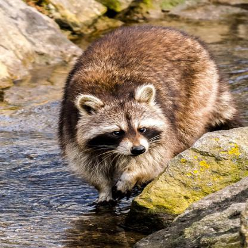
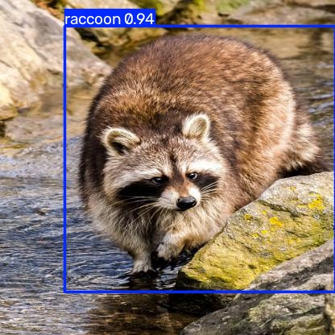

# YOLO object detection application

This project trains and runs an Ultralytics YOLO object detector through a
command-line interface. The `app` package exposes two commands:

* `train` adapts a base YOLO model to a labelled dataset.
* `detect` runs the trained model on an image, a folder, or a video and saves
    the predictions.

The application uses the Ultralytics Python API.

## Dataset structure

```sh
.
├── dataset/
│   ├── data.yaml
│   ├── images/
│   │   ├── train/
│   │   ├── val/
│   │   └── test/
│   └── labels/
│       ├── train/
│       ├── val/
│       └── test/
├── doc/
│   ├── dataset-example.jpg
│   └── dataset-example-frame.jpg
└── app/
    ├── __init__.py
    ├── __main__.py
    ├── train.py
    └── detect.py
```

The dataset directory must contain a `data.yaml` file. In this project it is:

```yaml
path: dataset
train: images/train
val: images/val
test: images/test

names:
    0: raccoon
```

The `path` entry is the dataset root. The other entries identify the image
directories for each split. `names` maps every numeric class ID used in the
label files to its class name. If the dataset has more classes, add them to
this mapping and use the corresponding IDs in the labels.

For object-detection training, every image must have a label file with the
same base name in the matching `labels` directory:

```sh
dataset/images/train/photo_001.jpg
dataset/labels/train/photo_001.txt
```

Each line in an annotation file uses the YOLO format:

```text
class_id center_x center_y width height
```

The example input image is
[`doc/dataset-example.jpg`](YOLO%20Detection/yolo-detector/doc/dataset-example.jpg).
This is the image stored in the dataset. The training process reads its
separate `.txt` annotation; it does not draw on or replace the original image.
The corresponding YOLO annotation is:

```text
0 0.5745192307692307 0.4675480769230769 0.7668269230769231 0.7668269230769231
```



The first value is the class ID. The next two values are the center of the
bounding box (`center_x`, `center_y`), followed by its width and height. All
four coordinates are relative to the image dimensions and must be between `0`
and `1`. During training, Ultralytics uses these values as annotation data.
Each line describes one object, so an image with several objects has several
lines.

For an image containing no objects from the configured classes, keep an empty
label file with the matching name. Do not label objects that are not part of
the dataset classes as if they were a known class.

The splits have different purposes:

* `train`: Images and labels used to train the detector.
* `val`: Different images and labels used to measure progress during training.
* `test`: Images reserved for a final evaluation or manual predictions.\
  *The related labels may be used to compare the expected annotations with the generated
  predictions.*

**Keep each image in only one split.** Do not put near-duplicates, frames from the
same short sequence, or the same scene in multiple splits, because that can
make the validation results look better than the real performance.
Keep the image and its label together when moving files between splits.

## Setup

The project uses Pipenv and targets Python 3.13.
The model can use an NVIDIA GPU when the installed PyTorch environment detects one.

From this project directory, create the environment and install the
dependencies with Pipenv:

```sh
pipenv install --dev
```

Select the Pipenv environment as the Python interpreter in VS Code. The
default base model is `yolo26n.pt`. When only a model name is supplied,
Ultralytics resolves it through its shared weights directory and downloads it
when necessary. A local model path can be supplied instead.

## Training

Place the images, labels, and `data.yaml` in the `dataset/` directory first.
Run the training command from the project directory:

```sh
python -m app train
```

The dataset path is optional and defaults to `./dataset`. To use another
dataset directory, pass its path:

```sh
python -m app train path/to/dataset
```

The available options are:

* `--model` or `-m`: base model, default `yolo26n.pt`.
* `--epochs` or `-e`: number of epochs, default `100`.
* `--batch` or `-b`: batch size, default `8`.
* `--image-size` or `-s`: training image size, default `640`.
* `--device` or `-d`: GPU index or `cpu`, default `0`.
* `--workers` or `-w`: image-loader worker processes, default `0`.
* `--output-folder` or `-o`: results directory, default `output`.
* `--output-name` or `-n`: training subdirectory, default `train`.

For example, to train on the CPU with a custom output name:

```sh
python -m app train --device cpu --output-name experiment-01
```

With the default options, the best trained model is saved at:

```sh
output/train/weights/best.pt
```

The output folder is created by Ultralytics and may contain metrics, logs,
checkpoints, and other training artifacts in addition to `best.pt`.

## Detection

Run detection by providing the source explicitly.
The source can be a single image, a directory of images, or a video:

```sh
python -m app detect --source path/to/image-or-folder
```

The default model is the model produced by the default training command:

```sh
output/train/weights/best.pt
```

To use a different trained model, pass its path with `--model`:

```sh
python -m app detect --source path/to/images --model path/to/model.pt
```

Detection options are:

* `--source` or `-s`: input image, directory, or video; required.
* `--model` or `-m`: trained `.pt` model.
* `--confidence` or `-c`: minimum confidence, default `0.25`.
* `--device` or `-d`: GPU index or `cpu`, default `0`.
* `--output-folder` or `-o`: results directory, default `output`.
* `--output-name` or `-n`: detection subdirectory, default `detect`.

With the default output options, annotated predictions and text results are
saved under `output/detect/`. Text predictions include confidence values.

The command reads the clean input image and saves a separate image with the
predicted boxes drawn over it. This is an example of that detection result:

[`doc/dataset-example-frame.jpg`](YOLO%20Detection/yolo-detector/doc/dataset-example-frame.jpg)



The predicted coordinates are converted into the blue rectangle shown in the
result image.

Higher confidence thresholds keep fewer, more certain detections; lower
thresholds keep more possible detections.

## Security and scope

This project is local and does not send images to an application service. It
uses Ultralytics and may download base weights the first time they are needed.
Keep datasets private when they contain sensitive images, and do not place API
keys or other secrets in this folder.
